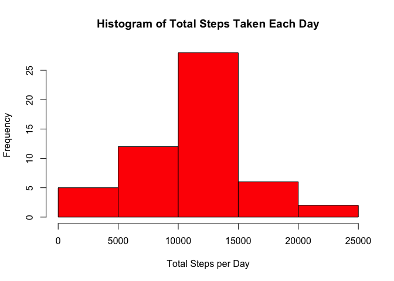
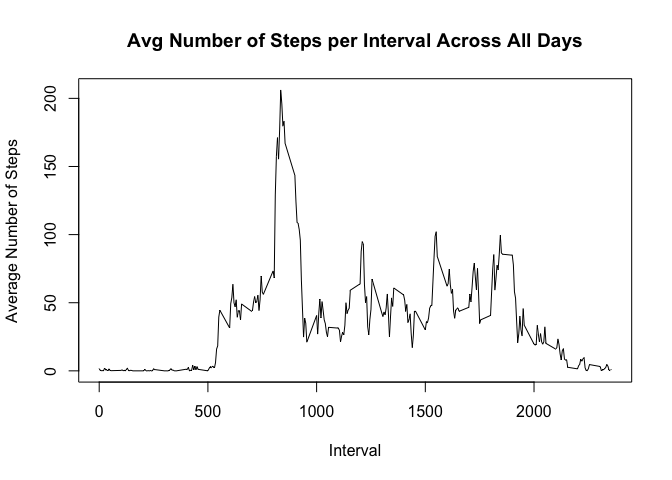
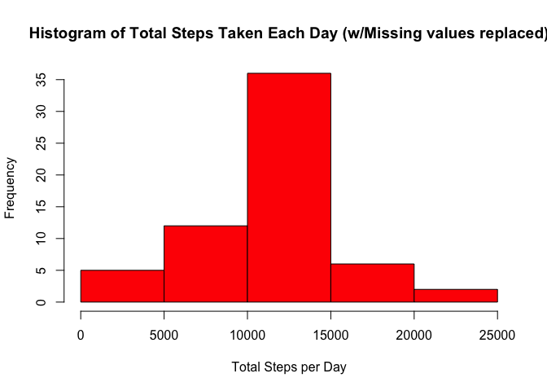
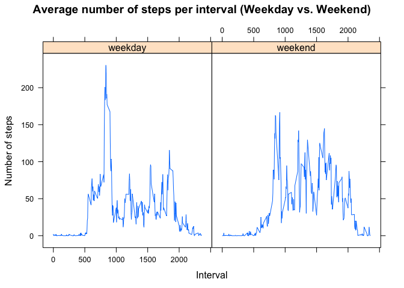

# Reproducible Research: Peer Assessment 1


## Loading and preprocessing the data

```r
library(dplyr) # use dplyr
```

```
## 
## Attaching package: 'dplyr'
## 
## The following objects are masked from 'package:stats':
## 
##     filter, lag
## 
## The following objects are masked from 'package:base':
## 
##     intersect, setdiff, setequal, union
```

```r
# display numbers as decimal rather than exponential
old.options <- options("scipen" = 100)
suppressWarnings(unzip("activity.zip", overwrite = FALSE))
data <- read.csv(file = "activity.csv", 
                 colClasses = c("numeric", "Date", "numeric"))
data <- tbl_df(data)
```


## What is mean, median, and total number of steps taken per day?

```r
sum_data <- data %>%
     filter(!is.na(steps)) %>%
     group_by(date) %>%
     summarise(total.steps = sum(steps))
hist(sum_data$total.steps, 
     col = "red", 
     main = "Histogram of Total Steps Taken Each Day",
     xlab = "Total Steps per Day")
```

 

```r
mean.steps <- mean(sum_data$total.steps)
median.steps <- median(sum_data$total.steps)
```
Mean steps per day: 10766.1886792  
Median steps per day: 10765

## What is the average daily activity pattern?

```r
avg.data <- data %>%
     filter(!is.na(steps)) %>%
     group_by(interval) %>%
     summarise(avg.steps = mean(steps))
plot(avg.data$interval,
     avg.data$avg.steps, 
     type = "l",
     xlab = "Interval",
     ylab = "Average Number of Steps",
     main = "Avg Number of Steps per Interval Across All Days")
```

 

```r
max.interval <- avg.data[avg.data$avg.steps == max(avg.data$avg.steps),
                         "interval"]
```
5-minute interval on average that contains the maximum number of
steps: 835

## Inputing missing values

###Calculate and report the total number of missing values in the dataset


```r
count.missing.steps <- sum(is.na(data$steps))
```
The total number of intervals with missing step counts 
is: 2304

###Fill in missing values using mean and median for interval across all days.

The strategy employed below is for each missing interval, set the missing
steps with the average number of steps at the cooresponding interval.


```r
# Create copy of data
data2 <- data
# Get missing intervals
missing.intervals <- data2[is.na(data2$steps), "interval"]
# Get average steps for each missing interval
avg.steps.per.interval <-
     sapply(missing.intervals$interval,
            function(i) avg.data[avg.data$interval == i, "avg.steps"]$avg.steps)
# Update missing steps with avg steps at corresponding interval
data2[is.na(data2$steps), "steps"] <- avg.steps.per.interval

#summarize data now that NA's are filled in.
sum_data2 <- data2 %>%
     group_by(date) %>%
     summarise(total.steps = sum(steps))
hist(sum_data2$total.steps, 
     col = "red", 
     main = "Histogram of Total Steps Taken Each Day (w/Missing values replaced)",
     xlab = "Total Steps per Day")
```

 

```r
mean.steps <- mean(sum_data2$total.steps)
median.steps <- median(sum_data2$total.steps)
```
Mean steps per day: 10766.1886792  
Median steps per day: 10766.1886792


## Are there differences in activity patterns between weekdays and weekends?

```r
# Create factor to designate if date is weekday or weekend
data2$week.part <- factor(weekdays(data2$date) == "Saturday" |
                               weekdays(data2$date) == "Sunday",
                          labels = c("weekday", "weekend"))

library(lattice)

# Calculate the average number of steps per interval grouped by
# weekday and weekend.
sum_data3 <- data2 %>%
     group_by(week.part, interval) %>%
     summarise(mean.steps = mean(steps))

xyplot(sum_data3$mean.steps ~ sum_data3$interval | sum_data3$week.part,
       type = "l",
       xlab = "Interval",
       ylab = "Number of steps",
       main = "Average number of steps per interval (Weekday vs. Weekend)")
```

 

```r
# Restore old options
options(old.options)
```
